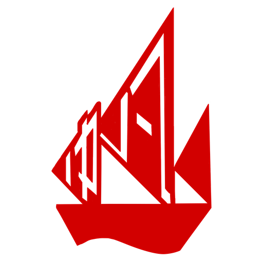
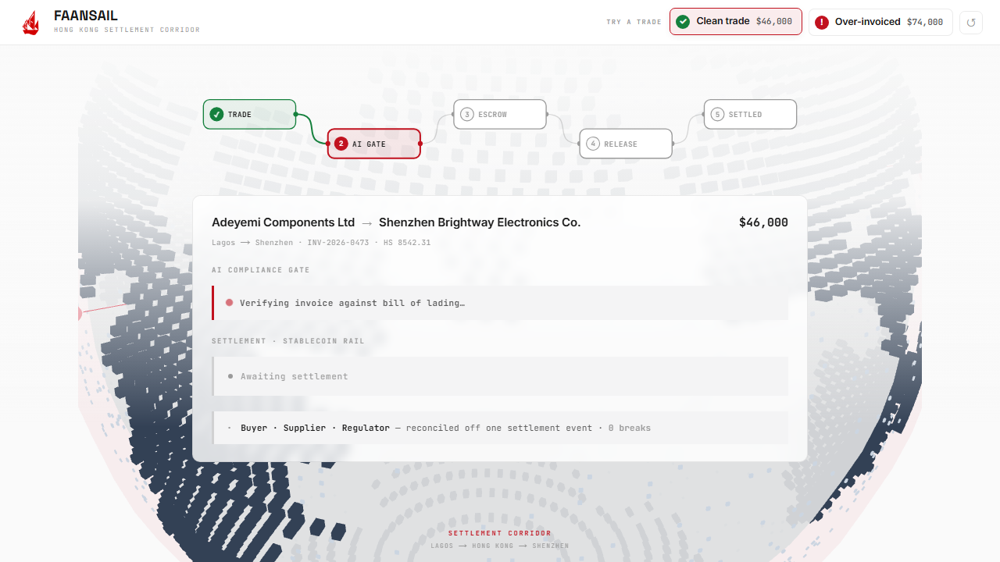

<div align="center">



# FAANSAIL

### AI-verified trade · smart-contract escrow · instant stablecoin settlement

**Compliance-native payment infrastructure for the Hong Kong corridor — the bad trade is *refused* before a cent moves; the good one settles in seconds on a stablecoin rail and reconciles itself off one on-chain event.**

[](https://nextjs.org)
[](https://soliditylang.org)
[](https://www.anthropic.com)
[](https://sepolia.etherscan.io/address/0x9527bAc8dDf0A3d3B42Af0F0C11F48fe1253540E#code)

<br/>



</div>

---

## How it works — the stack, end to end

```text
 ┌──────────────────────────────────────────────────────────────┐
 │  Console — Next.js 15 · React 19 · R3F globe · SSE stream     │
 └───────────────┬──────────────────────────────────────────────┘
                 │  POST /api/verify  { invoice, billOfLading, history }
                 ▼
 ┌──────────────────────────────────────────────────────────────┐
 │  PROOF-OF-TRADE GATE          (/api/verify, streamed)         │
 │   • lib/compliance.ts — DETERMINISTIC rules engine           │
 │       5 cross-doc checks → risk score → VERDICT of record    │
 │   • Claude (sonnet-4-6) — reads docs + explains (assist only)│
 └───────────────┬──────────────────────────────────────────────┘
                 │  verdict gates settlement (enforced on-chain)
                 ▼
 ┌──────────────────────────────────────────────────────────────┐
 │  CHAIN BRIDGE — lib/chain.ts  (ethers v6, oracle wallet)      │
 │     deposit() ── lock funds + trade passport                 │
 │     CLEAR → approveAndRelease()   BLOCK → reject()  onlyOracle│
 └───────────────┬──────────────────────────────────────────────┘
                 ▼
 ┌──────────────────────────────────────────────────────────────┐
 │  SEPOLIA — verified contracts                                 │
 │     TradeEscrow  passport: ref · HS · value · qty · parties · status
 │     MockUSDC     the stablecoin that actually moves          │
 │     events:      Locked · Settled · Blocked                  │
 └───────────────┬──────────────────────────────────────────────┘
                 ▼   read back live via getPassport()
      Buyer · Supplier · Regulator  →  one record, zero breaks
```

**The money flow, on real Sepolia wallets:**

```text
  Buyer 0xd2c3…8cb0 ──deposit $46,000──▶ TradeEscrow 0x9527…540E
                                              │  approveAndRelease()  (AI-cleared)
                                              ▼
                                         Supplier 0x7099…79C8  ✓ paid · block N
        (on BLOCK: reject() — funds held in escrow, supplier unpaid)
```

---

## Why it's novel
Payment rails move money and screen the **parties**. They never see the **trade**.

FaanSail is **proof-of-trade-gated settlement** — a new primitive where the compliance verdict is a *precondition of settlement*, enforced on-chain and bound into the same event:

- **It verifies the trade, not just the parties** — invoice vs. bill of lading, declared value vs. supplier history, beneficiary-account changes (the over-invoicing / trade-based money laundering that party-screening misses).
- **It can say *no*.** The over-invoiced trade is **refused before a cent moves** — `release()` is `onlyOracle`-gated by the verdict. Most "AI compliance" tools *flag*; ours *acts*, atomically.
- **Compliance + payment + audit collapse into one on-chain event** — buyer, supplier and regulator reconcile off the same `Settled` record. Zero breaks.
- **Verifiable compliance** — the verdict is a *deterministic rules engine*, not a black-box model call; anyone (a regulator included) re-runs it against the on-chain passport and gets the same answer. The LLM only reads the documents and explains.

The escrow itself is commodity Solidity; the novelty is the **fusion** — trade-legitimacy welded to settlement on a regulator-readable ledger — running **for real** on a public testnet, **built for the rail Hong Kong just licensed** (Stablecoins Ordinance · Project Ensemble).

## The problem
Cross-border B2B settlement on the Africa↔China corridor is still **3–5 days at ~6.3% all-in**, and it leaks in three places at once:
- **Liquidity** trapped in pre-funding (~$1M per $10M/month of flow at T+3).
- **Reconciliation** that takes days of manual matching across separate systems.
- **Compliance** that can't see the actual trade — so over-invoicing / trade-based money laundering / capital flight walks straight through.

## The three wins
- **Compliance** — the AI verdict gates the on-chain release. The refusal is *enforced* (`onlyOracle`), not advisory.
- **Liquidity** — instant compliance-cleared settlement **compresses the pre-funding window → trapped capital is freed** and flows can net. *We take no FX risk; a licensed partner provides liquidity — we make the problem smaller.*
- **Reconciliation** — **one event, three parties, zero breaks**, from the single settlement event.

## Architecture
| Layer | Tech |
|---|---|
| Frontend + AI gate | Next.js 15 (App Router), React 19 |
| Compliance | **Deterministic rules engine** (`lib/compliance.ts`) — 5 cross-document checks → risk score → the verdict of record. Claude is an *assist* (document extraction + explanation), streamed via SSE — it does **not** decide. |
| Contracts | Solidity — `MockUSDC` + `TradeEscrow` (passport + `deposit`/`approveAndRelease`/`reject`, `onlyOracle`) |
| Chain | Hardhat → **Sepolia** (and a local node); `ethers` v6 oracle wallet enforces the verdict on-chain |

## Run it locally
```bash
# 1. install
npm install
npm --prefix contracts install

# 2. local chain (separate terminal)
npm --prefix contracts run node

# 3. deploy + note the printed USDC_ADDRESS / ESCROW_ADDRESS
npm --prefix contracts run deploy:local

# 4. .env (repo root) — see .env.example; for local:
#    HARBOUR_ANTHROPIC_KEY=sk-ant-...        (optional; without it a deterministic fixture verdict streams)
#    RPC_URL=http://127.0.0.1:8545
#    ORACLE_PRIVATE_KEY=<hardhat account #0 key>
#    ESCROW_ADDRESS / USDC_ADDRESS=<from step 3>
#    NEXT_PUBLIC_CHAIN_MODE=local

# 5. run
npm run dev      # http://localhost:3000
```

## Run it on Sepolia (real public testnet)
```bash
# fund the Sepolia deployer (SEPOLIA_PRIVATE_KEY in .env) via a faucet, then:
npm --prefix contracts run deploy:sepolia
# set ESCROW_ADDRESS / USDC_ADDRESS to the Sepolia addresses, ORACLE_PRIVATE_KEY=<SEPOLIA_PRIVATE_KEY>,
# RPC_URL=<sepolia rpc>, NEXT_PUBLIC_CHAIN_MODE=sepolia  → settlements become Etherscan-verifiable.
```

## What's real vs. simulated
- **Real:** the **deterministic compliance engine** (auditable rules, the verdict of record — reproducible by anyone, incl. a regulator, from the on-chain passport); the escrow's conditional release/refuse on a public testnet (real txs, **verified** contracts); the **regulator read-back** (trade + verdict + status read live from the contract via `getPassport`); reconciliation off the one on-chain event.
- **Simulated (clearly labelled):** the settlement asset is mock USDC (stands in for an HKMA-licensed stablecoin), and the trade documents are fixtures — in production the LLM extracts these same fields from the raw PDF/EDI. The compliance, settlement and reconciliation *logic* is real; the architecture is identical to a production deployment.

## Live on Sepolia
Every settlement in the demo is a **real transaction on the Sepolia public testnet**, the contract source is **verified on Etherscan**, and the console links each actor straight there.

| Contract / wallet | On-chain role | Address |
|---|---|---|
| `TradeEscrow` (smart contract) | holds the funds, releases only on an AI pass — **[verified source ✓](https://sepolia.etherscan.io/address/0x9527bAc8dDf0A3d3B42Af0F0C11F48fe1253540E#code)** | [`0x9527…540E`](https://sepolia.etherscan.io/address/0x9527bAc8dDf0A3d3B42Af0F0C11F48fe1253540E) |
| `MockUSDC` (token) | the stablecoin that actually moves — **[verified source ✓](https://sepolia.etherscan.io/address/0x4dA689E28D7C99C624a7e4280C06e1fF59937be2#code)** | [`0x4dA6…7be2`](https://sepolia.etherscan.io/address/0x4dA689E28D7C99C624a7e4280C06e1fF59937be2) |
| Oracle / buyer (wallet) | funds the escrow, enforces the verdict | [`0xd2c3…8cb0`](https://sepolia.etherscan.io/address/0xd2c3e783655b8050256f3c127cc258af91c68cb0) |
| Supplier (wallet) | receives the stablecoin on `CLEAR` | [`0x7099…79C8`](https://sepolia.etherscan.io/address/0x70997970C51812dc3A010C7d01b50e0d17dc79C8) |

**What each piece is, in plain terms:**
- **Wallet (address)** — an account on the blockchain, like an IBAN. The buyer and supplier each have one.
- **Smart contract** — self-executing code. Our `TradeEscrow` holds the money and *cannot* release it unless the AI clears the trade — that rule is enforced by the code, not by us.
- **Stablecoin** — `MockUSDC`, a digital test-dollar; the asset that actually moves between the wallets.
- **Transaction** — the permanent, public record of the settlement; anyone can verify it on Etherscan.

## Tests
```bash
npm --prefix contracts test    # SETTLE (clean → released) + BLOCK (dirty → held)
```

## Honesty
See [`HONESTY.md`](./HONESTY.md) for exactly what was reused (UI scaffolding) vs. built during the hackathon (the whole settlement system), and [`PRODUCT.md`](./PRODUCT.md) for the full product spec.
